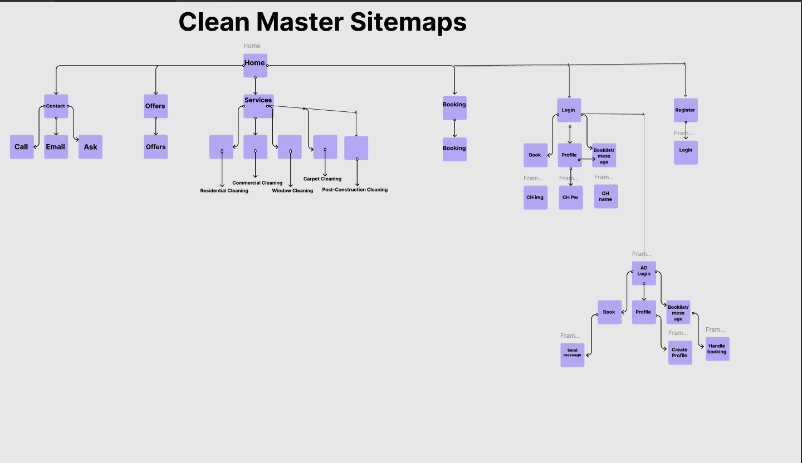

Clean Master - Städtjänst Webbapplikation

Välkommen till Clean Master, en fullstack webbapplikation utvecklad för att erbjuda en smidig och professionell upplevelse för att boka städtjänster. Projektet är skapat som en del av en skoluppgift för att visa mina kunskaper i modern webbutveckling, med fokus på både frontend och backend.

Funktioner och Beskrivning

Användarhantering: Användare kan registrera sig, logga in och uppdatera sina profiler, inklusive uppladdning av profilbilder.

Bokning av Tjänster: Användare kan boka städtjänster via bokningssidan där de kan välja tjänst, datum och tid.

Adminpanel: Administratörer kan hantera användare, se bokningar, och uppdatera användarinformation samt låsa upp konton vid behov.

E-postfunktionalitet: Administratörer kan skicka uppdateringar och meddelanden till användare via e-post.

Teknisk Stack

Frontend: React

Deployad via Netlify: https://cleanmaster12.netlify.app/

Backend: Node.js och Express

Deployad via Render: https://u09-fullstack-js-ahmedalmasrii.onrender.com

Databas: MongoDB Atlas

Autentisering: JWT-baserad autentisering för att skydda användardata.

Användarroller: Rollhantering för att skilja mellan vanliga användare och administratörer.

Filuppladdning: Multer används för att hantera profilbildsuppladdningar.

Installation och Körning Lokalt

För att köra projektet lokalt, följ dessa steg:

Klona detta repository:

Gå till projektmappen:

Installera beroenden för backend och frontend:

Skapa en .env-fil i rotmappen och lägg till följande:

Starta servern:

Starta frontend-applikationen:

Användarroller och Adminfunktioner

Endast administratörer har åtkomst till adminpanelen där de kan se alla användare, radera användare och låsa upp användarkonton.

Administratörer kan även skicka e-post direkt från adminpanelen för att kommunicera med användare om bokningar eller andra viktiga uppdateringar.

Sitemap

https://www.figma.com/design/mvsouMNkZtxFSRuv15rxHN/Clean-Master-Sitemap?node-id=0-1&m=dev&t=VXOEkWmp2xLDJ6Ty-1

Hem

Kontakt

Erbjudanden

Tjänster

Hemstädning

Kontorsstädning

Fönsterputsning

Matttvätt

Byggstädning

Boka Tjänst

Registrera / Logga In

Profil (för inloggade användare)

Adminpanel (för administratörer)

Deployment

Frontend: https://cleanmaster12.netlify.app/

Backend: Render : https://u09-fullstack-js-ahmedalmasrii.onrender.com

Low fidelity
Figma : https://www.figma.com/design/k6XoF7b9pYtM66H98bh5az/U09?node-id=0-1&m=dev&t=lHy7XhSwtALdvJV1-1

SiteMap
https://www.figma.com/design/mvsouMNkZtxFSRuv15rxHN/Clean-Master-Sitemap?node-id=0-1&m=dev&t=VXOEkWmp2xLDJ6Ty-1

Tack för att du använder Clean Master! Denna webbapplikation är utvecklad för att göra bokningen av städtjänster enklare och mer tillgänglig för alla. Om du har några frågor eller feedback, tveka inte att kontakta mig.
